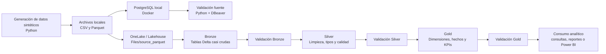

# Arquitectura de la solución

Este documento describe la arquitectura que diseñé para la prueba técnica. La solución sigue un enfoque end-to-end: genero datos sintéticos, los cargo en una fuente relacional simulada, los llevo a Microsoft Fabric y los proceso por capas usando el patrón Medallion.

## Vista general

## Componentes principales

| Componente | Herramienta | Función en la solución |
|---|---|---|
| Generación de datos | Python, Pandas, NumPy, Faker | Crear datos sintéticos realistas del escenario RetailMax |
| Fuente transaccional simulada | PostgreSQL en Docker | Representar una base relacional de origen |
| Revisión visual | DBeaver | Validar tablas, conteos y estructura desde un cliente SQL |
| Plataforma cloud | Microsoft Fabric | Ejecutar el pipeline de datos en Lakehouse y notebooks |
| Almacenamiento analítico | OneLake / Lakehouse | Organizar archivos y tablas Delta por capas |
| Transformación | PySpark en Fabric | Construir Bronze, Silver y Gold |
| Orquestación | Fabric Data Factory Pipelines | Definir el orden de ejecución y dependencias |
| IaC | Terraform | Documentar y preparar infraestructura como código |
| Control de versiones | Git | Mantener historial de cambios del proyecto |

## Capas del modelo Medallion

### Bronze

En Bronze dejo los datos casi crudos. Mi objetivo en esta capa es conservar trazabilidad del origen y agregar metadatos de auditoría, como fecha de ingesta, tabla origen, archivo origen y modo de carga.

No aplico reglas fuertes de negocio en Bronze porque esa responsabilidad queda para Silver.

### Silver

En Silver preparo los datos para que sean confiables. Aquí convierto tipos, limpio textos, normalizo fechas, creo banderas de calidad y protejo datos sensibles.

Una decisión importante fue proteger el correo de clientes creando `email_hash` y eliminando el correo original de la capa analítica.

### Gold

En Gold construyo el modelo orientado al análisis. Esta capa contiene dimensiones, tabla de hechos y KPIs de negocio relacionados con ventas, devoluciones, inventario y clientes.

## Decisiones de arquitectura

- Elegí Microsoft Fabric porque integra Lakehouse, notebooks, pipelines y consumo analítico en una misma plataforma.
- Usé PostgreSQL local para simular una fuente transaccional realista sin depender de una base cloud adicional.
- Pasé los datos hacia Fabric mediante Parquet porque es un formato analítico eficiente y compatible con Spark.
- Dejé las fechas en Parquet como texto `YYYY-MM-DD` para evitar incompatibilidades con Spark en Fabric y hacer la conversión formal en Silver.
- Separé validaciones por capa para evitar que errores de Bronze pasen a Silver o que errores de Silver lleguen a Gold.
- Documenté la orquestación en YAML para que el flujo sea entendible y reproducible aunque el trial limite exportaciones desde la interfaz.

## Supuestos

- La solución usa un perfil de datos `dev` para mantener tiempos de ejecución razonables durante la prueba.
- Los datos son sintéticos y no representan personas reales.
- La capacidad Fabric Trial puede limitar algunas automatizaciones; por eso documento las acciones manuales y dejo equivalentes versionados cuando aplica.
- Para el alcance de la prueba uso escrituras `overwrite`, lo que permite repetir el pipeline sin duplicar registros.
