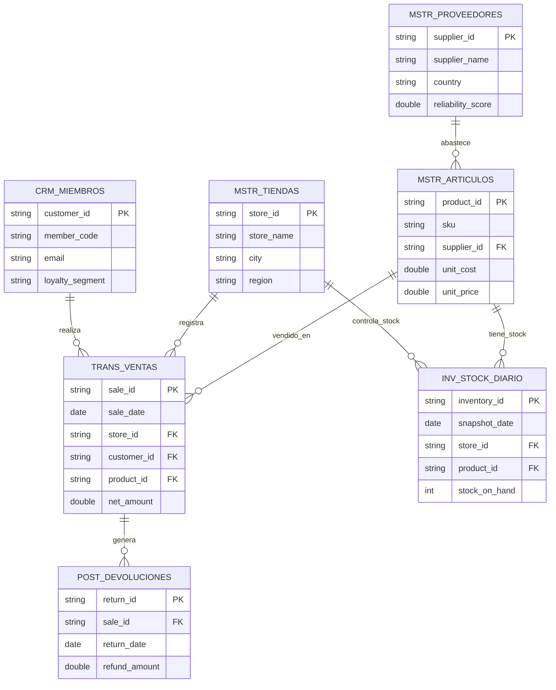
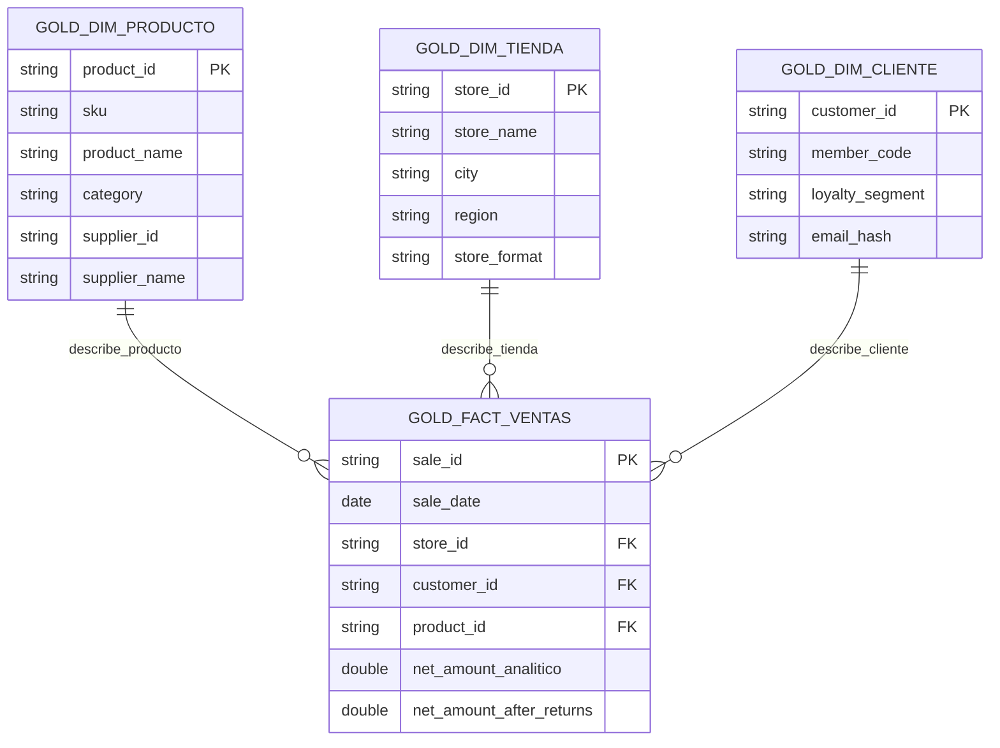

# Modelo entidad-relación y modelo analítico

Este documento resume las relaciones principales del modelo fuente y cómo esas relaciones se convierten en un modelo analítico en Gold.

## Modelo relacional fuente

## Relaciones principales

| Relación | Explicación |
|---|---|
| Proveedor a producto | Un proveedor puede abastecer varios productos |
| Producto a venta | Un producto puede aparecer en muchas ventas |
| Tienda a venta | Una tienda o canal registra muchas ventas |
| Cliente a venta | Un cliente puede realizar muchas compras; también existen compras invitadas |
| Venta a devolución | Una venta puede generar una o varias devoluciones |
| Producto y tienda a inventario | El inventario se controla por producto, tienda y fecha |

## Modelo analítico Gold

En Gold uso un modelo orientado a análisis. La tabla central es `gold_fact_ventas`, y alrededor de ella quedan dimensiones para producto, tienda y cliente.

## KPIs derivados

Además del modelo de dimensiones y hechos, construí tablas agregadas para facilitar el análisis:

- `gold_kpi_ventas_diarias`: ventas, descuentos y devoluciones por fecha y canal.
- `gold_kpi_inventario_diario`: productos agotados y en riesgo de quiebre por tienda y fecha.
- `gold_kpi_clientes_rfm`: recencia, frecuencia y valor monetario de clientes.

Estas tablas no reemplazan la tabla de hechos, sino que resumen preguntas de negocio frecuentes para que el consumo analítico sea más directo.
