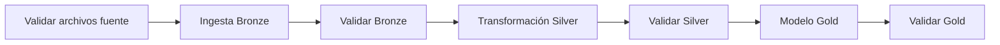

# Orquestación del pipeline

En este proyecto elegí **Microsoft Fabric Data Factory Pipelines** como orquestador principal porque ya estoy usando Fabric como plataforma cloud, el Lakehouse vive en el mismo workspace y los notebooks de Bronze, Silver y Gold se ejecutan dentro del mismo entorno.

La orquestación busca que el pipeline no dependa de ejecutar celdas sueltas sin orden. La idea es definir una secuencia clara de actividades, con validaciones entre capas para evitar que una transformación avance si la capa anterior no quedó correcta.

## Pipeline implementado

Nombre del pipeline:

```text
pl_retailmax_medallion
```

Workspace:

```text
ws_retailmax_data_dev
```

Lakehouse:

```text
lh_retailmax_medallion
```

La definición lógica del pipeline queda documentada en:

```text
orchestration/orquestacion_retailmax_fabric.yaml
```

El pipeline también fue materializado en Microsoft Fabric como una canalización visual con tres actividades de notebook conectadas por condición de ejecución correcta:

```text
01_bronze_ingesta_validacion
  -> 02_silver_transformacion_validacion
  -> 03_gold_modelo_validacion
```

La evidencia de ejecución correcta quedó guardada en:

```text
docs/evidencias/capturas/08_fabric_orquestacion_pipeline.png
```

## Orden de ejecución



## Actividades del pipeline

| Orden | Actividad | Tipo | Script base | Resultado esperado |
|---:|---|---|---|---|
| 1 | Validar archivos fuente | Control | `data/source/` y `Files/source_parquet/` | Confirmar que existen los 7 archivos esperados |
| 2 | Ingesta Bronze | Notebook Fabric | `pipelines/bronze/01_ingesta_bronze_fabric.py` | Crear tablas `bronze_` |
| 3 | Validar Bronze | Notebook Fabric | `pipelines/bronze/02_validar_bronze_fabric.py` | Confirmar conteos de tablas Bronze |
| 4 | Transformación Silver | Notebook Fabric | `pipelines/silver/01_transformacion_silver_fabric.py` | Crear tablas `silver_` |
| 5 | Validar Silver | Notebook Fabric | `pipelines/silver/02_validar_silver_fabric.py` | Confirmar reglas de calidad y conteos |
| 6 | Modelo Gold | Notebook Fabric | `pipelines/gold/01_modelo_gold_fabric.py` | Crear dimensiones, hechos y KPIs |
| 7 | Validar Gold | Notebook Fabric | `pipelines/gold/02_validar_gold_fabric.py` | Confirmar métricas analíticas principales |

## Manejo de dependencias

Cada actividad depende de la finalización correcta de la anterior. Si una validación falla, el pipeline debe detenerse y no debe ejecutar la siguiente capa.

Esta decisión es importante porque evita construir Silver con una Bronze incompleta o calcular KPIs Gold sobre datos que no pasaron reglas mínimas de calidad.

## Idempotencia

Durante el desarrollo configuré las escrituras principales en modo `overwrite`. Esto significa que si vuelvo a ejecutar el pipeline, las tablas se reemplazan en lugar de duplicar registros.

Para el alcance de esta prueba, esta decisión me ayuda a mantener el proceso repetible y fácil de validar. En un escenario productivo podría cambiarse por cargas incrementales o `MERGE`, pero para esta entrega prioricé claridad, reproducibilidad y control de errores.

## Reintentos y errores

La configuración recomendada para cada actividad es:

- reintentos: 1;
- intervalo entre reintentos: 2 minutos;
- timeout por actividad: 30 minutos;
- condición de avance: solo si la actividad anterior finaliza correctamente.

Si una actividad falla, el error debe revisarse en la salida del notebook correspondiente. En esta prueba las validaciones lanzan errores explícitos cuando los conteos o condiciones mínimas no se cumplen.

## Supuesto de implementación

Como estoy trabajando con una capacidad Trial de Fabric, mantengo la definición del pipeline versionada en el repositorio y la implementación visual creada desde la interfaz de Fabric. Esta decisión me permite demostrar la orquestación real sin depender de una exportación automática del pipeline, que puede variar según las capacidades disponibles en el trial.
